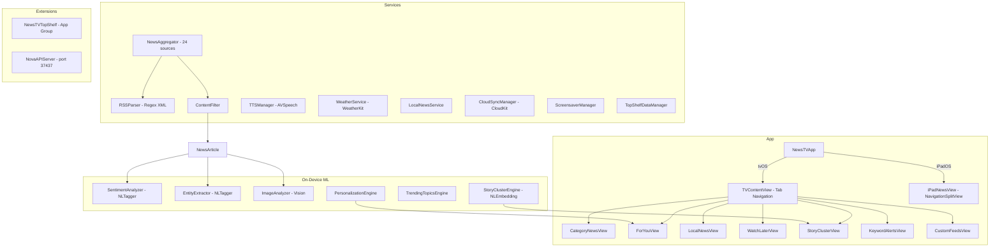

# NewsTV

**On-device ML news reader for Apple TV and iPad**


[](https://opensource.org/licenses/MIT)


NewsTV aggregates headlines from 24 RSS sources across 10 categories, runs NaturalLanguage sentiment analysis and named entity recognition on every article, clusters related stories from different outlets for bias comparison, and learns viewing habits to build a personalized "For You" feed. All ML inference runs on-device. Includes text-to-speech briefings, a Top Shelf extension, screensaver mode, WeatherKit integration, and iCloud sync via CloudKit.

---

## Architecture



---

## Features

| Category | Details |
|----------|---------|
| **Sentiment Analysis** | NLTagger `.sentimentScore` scores headlines -1.0 to +1.0 with color indicators |
| **Named Entity Recognition** | NLTagger `.nameType` extracts people, organizations, locations |
| **Image Analysis** | Vision framework -- VNClassifyImage, VNDetectFaces, VNRecognizeText |
| **Story Clustering** | NLEmbedding cosine similarity (threshold 0.6) groups related articles; shows left/center/right perspective breakdown |
| **Trending Topics** | Entity frequency + proper-noun analysis across all feeds |
| **Personalization** | Tracks view duration; category (40%) + source (30%) + recency (30%) scoring; unread boost |
| **24 RSS Sources** | NPR, ABC, CBS, NY Times, USA Today, BBC, Guardian, TechCrunch, Ars Technica, The Verge, Wired, CNBC, Science Daily, ESPN, Variety, EW, Politico, and more |
| **Content Filtering** | Strips ads, clickbait, press releases via keyword and pattern detection |
| **Breaking News** | Title keyword scanning with priority sorting |
| **Audio Briefings** | AVSpeechSynthesizer with play/pause/skip, configurable rate, transition phrases |
| **Watch Later** | Bookmark queue synced via CloudKit |
| **Keyword Alerts** | Monitor all feeds for specific terms with badge counts |
| **Local News** | ZIP code or city-based news lookup |
| **Weather** | WeatherKit conditions with CLGeocoder, rate-limited |
| **Screensaver** | Rotating headline display after configurable idle timeout |
| **iCloud Sync** | CloudKit private database for settings, watch later, audio progress, preferences |
| **Background Refresh** | Configurable interval (default 5 minutes) |
| **Top Shelf** | TVTopShelfContentProvider shows cached headlines on tvOS home screen |
| **Custom Feeds** | Add any RSS URL |
| **Local API** | NWListener on 127.0.0.1:37437 -- `/api/status`, `/api/ping` |

---

## Platform Support

| Platform | UI | Navigation |
|----------|----|------------|
| **tvOS** (primary) | Focus-based, large typography, dark theme | 7-tab bar: News, For You, Local, Watch Later, Multi-Source, Alerts, My Feeds |
| **iPadOS** | NavigationSplitView three-column layout | Sidebar, pull-to-refresh, share sheet, search, keyboard shortcuts |

---

## News Sources

| Category | Sources | Bias |
|----------|---------|------|
| Top Stories | NPR, ABC News, CBS News | Lean Left, Center, Center |
| US | NY Times US, USA Today | Lean Left, Center |
| World | BBC World, The Guardian, NY Times World | Center, Left, Lean Left |
| Technology | TechCrunch, Ars Technica, The Verge, Wired | Center, Center, Lean Left, Center |
| Business | CNBC, NY Times Business | Center, Lean Left |
| Science | Science Daily, NY Times Science | Center, Lean Left |
| Health | NY Times Health | Lean Left |
| Sports | ESPN, NY Times Sports | Center, Lean Left |
| Entertainment | Variety, Entertainment Weekly | Center, Center |
| Politics | Politico, NY Times Politics | Center, Lean Left |

Seven-point bias spectrum: Far Left, Left, Lean Left, Center, Lean Right, Right, Far Right.

---

## Requirements

- tvOS 17.0 (Apple TV 4K recommended) or iPadOS 17.0
- Xcode 15.0+ (build from source)
- iCloud account (optional, for sync)

---

## Build

```bash
git clone git@github.com:kochj23/NewsTV.git
cd NewsTV
open NewsTV.xcodeproj
# Select Apple TV or iPad, Cmd+R
```

Zero external dependencies. Apple first-party frameworks only: SwiftUI, NaturalLanguage, Vision, AVFoundation, WeatherKit, CloudKit, CoreLocation, Network, TVServices.

**Codebase:** 47 Swift files, ~11,000 lines.

---

## Test Suite

121 XCTest cases covering models, parsing, filtering, and security.

| Category | Tests | Description |
|----------|-------|-------------|
| NewsArticle Model | 13 | Creation, defaults, equality, hashing, recency, timeAgo, Codable, mutability, breaking |
| NewsCategory | 4 | All cases, icons, colors, Codable |
| SourceBias | 7 | Values, ordering, symmetry, short labels, colors, Codable |
| BiasRating | 4 | Labels, lean labels, boundary, Codable |
| SentimentResult | 3 | Labels, icons, Codable |
| ExtractedEntity | 3 | Creation, entity types, Codable |
| StoryCluster | 2 | Multi-source grouping, date tracking |
| WatchLaterItem | 2 | Creation from article, Codable |
| UserPreference | 4 | Default profile, recordView, relevanceScore, Codable |
| Settings | 4 | Defaults, font sizes, temperature units, Codable |
| RSSParser | 5 | XML parsing, titles, breaking news, HTML stripping |
| ContentFilter | 6 | Ads, clickbait, legitimate articles, punctuation, quality scoring |
| Security | 4 | No hardcoded keys, HTML sanitization, URL schemes, Codable leaks |
| **Total** | **121** | |

```bash
xcodebuild test -scheme NewsTV -sdk appletvsimulator \
  -destination "platform=tvOS Simulator,name=Apple TV"
```

---

## Known Limitations

- tvOS has no WebKit -- articles limited to RSS descriptions.
- tvOS does not support user push notifications.
- No inline article images on tvOS (category icons shown instead; iPad uses AsyncImage).

---

## Privacy and Security

- All ML runs on-device. No article content or user data sent externally.
- No analytics, telemetry, or tracking. No sign-in required.
- No API keys or credentials required or stored.
- Local API binds to loopback only (127.0.0.1).
- No external dependencies to audit.

---

## Related Projects

- [NewsMobile](https://github.com/kochj23/NewsMobile) -- iPhone/iPad version

---

## License

MIT License. See [LICENSE](LICENSE).

Copyright (c) 2026 Jordan Koch.

---

Written by **Jordan Koch** ([@kochj23](https://github.com/kochj23))
